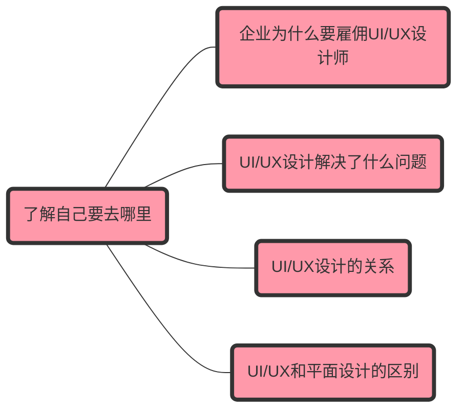

# 00了解自己要去哪里

## 001企业为什么要雇佣UI/UX设计师？

1. UI/UX设计师是创建直观、用户友好、具有视觉吸引力的界面的专家（数据驱动的设计方法会设计出符合目标受众特定需求和偏好的产品；紧跟设计潮流和技术，不断优化用户体验）。企业需要能够提升用户体验的界面，因为这样才有可能**提高用户满意度、和参与度最终留存**住客户，让客户购买企业的产品，最后**盈利并增加销售数量**。

2. **减少**用户培训或客户支持的**成本**，给客户带来流畅的体验。

3. **提高**用户注册、购买或其他行动的**转换率，增加流量。**

4. **扩大受众，增加销售数量**。UI/UX设计师可以针对不同屏幕的移动设备进行界面的优化，有利于扩大受众范围。UI/UX设计师会考虑可访问性的需求，扩大潜在用户群（比如残障人士）

5. 具有优秀用户体验设计能力是一个企业的一项**竞争优势**。

6. 能够传达企业良好的**品牌形象**。

## 002UI/UX设计解决了什么问题？

1. 防止品牌信息含糊不清，产品需要为用户提供清晰的细节：产品/服务是什么？UX能帮忙回答“是什么”和“在哪里”的问题。

2. 确定重要的数据收集点。骨架原型为数据分析师提供了定义数据收集点所需的视觉效果。

3. 创造个性化空间。

4. 让品牌有能力影响用户的使用过程。可以影响用户的浏览过程。

5. 解决不同平台体验不一致的问题。

## 003UI和UX设计的关系？

### 区别

UI注重开发交互式、用户友好的界面。设计按钮、图标和视觉元素。只适用于数字产品和体验。UX注重发现和解决用户问题。设计流程、导航和用户满意度。适用于任何服务、产品或体验。

### 联系

UI遵循UX的理念。UX会绘制出用户旅程的关键要素。然后，UI再添加图形和交互组件，完成设计。

## 004UX/UI设计和平面设计(Graphic Design)的区别？

### 职位描述的区别

#### 平面设计师(Graphic Designer)

使用色彩、形状、图像和字体为印刷和数字媒体创建视觉内容。这些设计通常是静态的、非交互式的布局，如标识、产品包装、广告、标牌、小册子或展示架，用于与客户沟通。忠于品牌形象。

#### UI设计师

平面设计师设计静态视觉内容，而用户界面（UI）设计师则设计交互式视觉内容。这包括用户与之交互的应用程序、网站和电子设备的图形元素。

#### UX设计师

关注用户与产品之间的互动，包括这种体验给用户带来的感受。这类设计超越了视觉范畴，包括设计、用户研究、信息架构、线框图和原型设计等多学科技能。以用户为中心。

### 日常工作内容的区别

#### 平面设计师的日常工作可能包括

·与客户和艺术总监合作

·创建徽标、图像和插图

·为布局选择颜色、图像和字体

·使用数字插图工具和照片编辑软件

#### 用户体验设计师的日常工作可能包括

·通过用户研究确定用户需求、目标、行为和痛点

·创建用户角色和用户旅程图

·设计网站地图、线框图和原型

·通过用户测试验证设计，并迭代新功能或修复功能

·与产品设计师、开发人员、用户界面设计师和利益相关者合作

## 参考资料

[Become a UI/UX designer in 2024 - A step by step guide](https://www.youtube.com/watch?v=HmKwiEmJIdM)

[How to Become a UX Designer: Step-By-Step Guide (2023)](https://blog.hubspot.com/website/become-a-ux-designer#:~:text=Take%20a%20UX%20design%20course.%20Create%20some%20designs,Network.%20Apply%20to%20UX%20designer%20jobs.%20Keep%20learning.)

[What Is The Use Of UI/UX Design? Why Companies Hire UI/UX Designer?](https://www.linkedin.com/pulse/what-use-uiux-design-why-companies-hire-designer-h2e6f)

[Why Your Company Needs UI/UX Design Services?](https://www.vlinkinfo.com/blog/why-your-company-needs-uiux-design-services/)

[5 Reasons Why Your Business Needs a UI/UX Design Services Company](https://thebossmagazine.com/ui-ux-design-services/)

[What Business Problems Does UX Design Solve?](https://yujdesigns.medium.com/what-business-problems-does-ux-design-solve-89d97982c0a2)

[What are examples of hard UX design problems?](https://www.quora.com/What-are-examples-of-hard-UX-design-problems)

[UX Design vs. Graphic Design: Choosing the Right Career Path](https://www.coursera.org/articles/ux-design-vs-graphic-design)