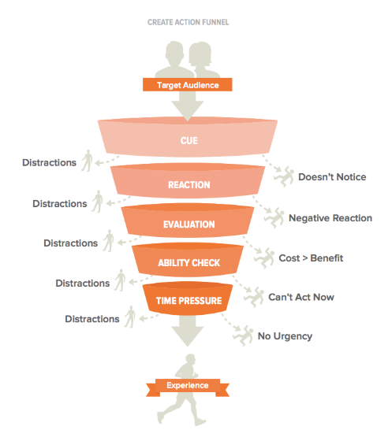

# 01 了解人类决策

## 001 介绍

​	人的决策过程是一个认知过程，人们通过这个过程分析信息、评估选项，并根据自己的喜好、目标和愿望选择一种行动方案。在UX设计领域，这个决策过程尤其重要，因为设计师必须了解用户是如何做出决策的，才能设计出直观高效的界面。

### 影响决策的因素

#### 认知偏差Cognitive biases

| 偏差         | 描述                                                         |
| :----------- | ------------------------------------------------------------ |
| 锚定偏差     | [人类](https://zh.wikipedia.org/wiki/人類)在进行决策时，会过度偏重先前取得的资讯（这称为[锚](https://zh.wikipedia.org/wiki/錨)点），即使这个资讯与这项决定无关。在进行决策时，人类倾向于利用此片断资讯（锚点），快速做出决定。在接下来的决定中，再以第一个决定为基准，逐步修正。 |
| 可得性偏差   | 人们在做决定时倾向于根据自己能够回忆起来的信息来判断某件事发生的概率或频率而不是基于实时和统计数据。 |
| 从众效应     | 人们受到多数人的一致思想或行动影响，而跟从大众之思想或行为，常被称为“**羊群效应**”。 |
| 支持选择偏见 | 人一旦做出决定就会相信自己做了正确的选择[[2\]](https://zh.wikipedia.org/wiki/支持選擇偏誤#cite_note-2)。例如如果一个人选择了A选项而不是B选项，他们很可能会忽视或淡化A选项的缺点，而放大或赋予B选项的负面缺点。“我的选择是正确的”。 |
| 确认偏见     | 个人选择性地回忆、搜集有利细节，忽略不利或矛盾的[资讯](https://zh.wikipedia.org/wiki/資訊)，来支持自己已有的想法或假设的趋势。 |
| 鸵鸟偏见     | 忽略消极方面。往往助长无知。                                 |
| 结果偏见     | 人们得知某一事件**结果**后，夸大原先对这一事件的猜测的倾向，俗语称“事后诸葛”或“事后孔明”。 根据决策后事情的结果来判断决策的有效性。 |
| 过度自信效应 | 是指一个人对自己的主观信心远大于客观准确性，尤其特别是当信心相对较高时。 |
| 安慰剂偏见   | 预想/相信某事有效/会发生，而结果真的有效/发生的现象。        |
| 幸存者偏差   | 当过度关注“幸存”的人事物，从而造成忽略那些没有幸存的（也可能因为无法观察到），便会得出错误的结论。“我们很难知道不知道的事情”。 |
| 选择性感知   | 人们常常选择忽略与信念或期望相反的事情。                     |
| 盲点         | “Bias bias”认为自己没有偏见。指一个人对于事物的偏见或无知。  |

#### 情绪Emotion

即使人们认为自己是在做出理性的选择，情绪也会在很大程度上左右决策。用户体验设计师应考虑如何通过设计元素来激发积极情绪，并尽量减少消极情绪。

#### 信息超载Information overload

接受太多信息，反而影响正常的理解与决策。用户体验设计师需要以易消化、易获取的方式组织和呈现信息。

### 决策模型

#### 补偿模型Compensatory model

指产品各属性上的优缺点可以互相抵消或补偿。消费者在决策时，会权衡各种因素，像评分一样，产品在某些属性上的优势可以抵消在其它属性上的短板。这种决策过程主要依赖于整体评估。

#### 非补偿模型Non-compensatory model

消费者在考虑决策对象时，产品在属性上的缺点或弱点无法由其他属性的优点来弥补。也就是说，只要备选产品存在消费者不能接受的属性缺点，则该产品无法被消费者接受，无论其在其他属性上有多优秀。

#### 满意模型Satisficing model

满意模型是一种描绘顾客满意度形成过程的因果关系模型。满意模型主要对顾客满意度评价过程中的各因素，以及它们之间的因果关系进行抽象模拟。

在众多的顾客满意模型中，比较常用的有：

1. **期望满意度模型**：也称预期满意度模型，主要是将满意度看作是客户对产品或服务<u>预期与实际感受的差距</u>。如果实际感受超过预期，顾客就会感到满意。反之，则感到不满意。
2. **感知满意度模型**：看重的是顾客感知到的产品或服务质量。基于顾客的<u>直观感受</u>，评判产品或服务的优劣，从而产生满意或不满意的评价。
3. **比较满意度模型**：将满意度理解为顾客对于当前产品或服务<u>与其他同类产品或服务的比较</u>。如果当前产品或服务比其他同类产品或服务更优秀，顾客就会感到满意。

### 支持决策的设计原则

#### 逐步披露Progressive disclosure

通过将信息、功能或操作分层来呈现，初级或基础的内容（这些内容通常是最重要的）首先展现给用户，更复杂或高级的内容则在用户需要时才提供。

许多软件在初次打开时只会**显示**核心功能的界面，而将一些高级操作各功能放在了设置菜单或附属面板中，用户可以根据自身的需求和能力来逐渐熟悉和探索更多的功能。对于复杂的多步骤**任务**，只显示当前步骤，当前步骤可以显示更多的细节。

需要额外的交互成本，但是如果大多数用户不需要这些隐藏信息，那么这个成本是可接受的。

#### 认知辅助Cognitive aids

通过及时提供提醒、通知和视觉提示，帮助用户记住重要信息或任务。

在产品设计中，在设计流程中构建的界面提示和帮助文档可以视为一种认知辅助，帮助用户理解和快速掌握产品的使用方法。

#### 反馈Feedback

即时反馈可帮助用户了解其决策的结果，并引导他们实现预期成果。这可以通过视觉提示、信息和动画来实现。

#### 默认设置Defaults

使用智能默认设置，帮助用户根据实际情况做出决定，包括预填表单和建议选项。

## 002框架

### BJ 福格行为模式

著名心理学家、斯坦福大学研究员 B.J. 福格提出了福格行为模型（FBM）。福格行为模式表明，行为的发生必须同时具备三个要素：动机**Motivation**、能力**Ability**和提示**Prompt**。在 FBM 中，"能力"（Ability）一词指的是 "简单因素 "如何在 "提示 "的背景下共同发挥作用。

#### 动机Motivation

这一要素强调的是用户希望执行某种操作或获得特定结果的愿望。动机可与三个核心要素联系起来，即感觉（快乐/痛苦）、预期（希望/恐惧）和社会凝聚力（归属/排斥）。

#### 能力Ability

能力是指用户执行所需操作的体力和脑力。为了提高用户的能力，用户体验设计师应遵循简单原则。操作越简单，用户就越有可能使用产品。需要考虑的一些因素包括时间、财力、体力和认知负荷。

#### 提示Prompt

提示用户采取行动的线索、通知或提示。为了让用户采取行动，提示应在用户有足够动力和能力的时候适时出现。需要在适当的时间提醒个体采取行动。无论个体多么有动机，且有足够的能力，如果没有适当的提示，行动往往不会发生。

### 斯蒂芬-温德尔的CREATE行动漏斗

通过一个系统的、吸引人的过程，将网站访问者转化为活跃客户。

- **Cue**线索--让你想到要采取特定行动的触发因素
- **Reaction**反应--你对采取行动这一想法的本能第一反应
- **Evaluation** 评估--对采取行动的成本与收益进行更理性的分析
- **Ability Check** 能力检查--看你现在是否有能力采取该行动
- **Time Pressure** 时间压力--确定是否迫切需要立即采取行动
- **Experience**体验--采取行动的行为以及随之而来的感受

#### 主要步骤

1. **确定目标**：在深入设计之前，请明确定义您希望通过网站或应用程序实现的目标。确定您希望用户采取哪些行动（如注册、购买、分享内容），以及什么是成功转换。
2. **了解用户心态**：确定目标受众，了解他们的需求、偏好、情感和痛点。要做到这一点，需要进行用户研究、创建 "角色"、绘制 "故事板 "和 "移情绘图 "等方法。
3. **设计最佳用户流程**：通过设计从登陆页面到所需操作的清晰路径，打造无缝、直观的用户旅程。优先考虑简洁性、可用性和效率。确保包含有意义的接触点和互动，以吸引用户并让他们轻松完成预期操作。
4. **完善和测试体验**：使用线框图和原型来测试和迭代完善用户体验。采用用户测试、A/B 测试和分析方法，深入了解用户行为、偏好和参与度。不断利用反馈进行改进，确保设计能有效地引导访客进入行动漏斗。

### 思维干预谱系Spectrum of Thinking Interventions

用于理解人类决策过程并进行有效干预的一个框架。

#### 指导

帮助用户以最小的代价浏览数字产品或服务。它们可能针对完全的初学者、临时用户或各自领域的专家。

例如

- Visual cues (e.g., icons, colors)
- Signposting (e.g., breadcrumbs)
- In-context information (e.g., tool tips, hints)

#### 说明

为用户提供详细的叙述、概述或背景信息，帮助他们做出明智的决定。这可能包括教程、文章、视频或任何其他有助于解释复杂概念或说明的媒介。

例如

- 多媒体教学
- 文章或博客文章
- 信息图表

#### 探索

鼓励用户通过调查、提问或自行寻找解决方案来了解产品并与之互动。这可以通过提供互动元素、多种途径和探索机会来实现。

例如

- 交互式模拟或模型
- 高级搜索功能
- 完成任务的多种用户界面路径

#### 创造

通过向用户提供共同创造或定制体验的工具和资源来吸引用户。这类干预措施通常需要用户更广泛的投入和参与，因为他们是设计过程的积极参与者。

例如

- 可定制的用户界面
- 允许用户创建自己的内容
- 让用户能够管理自己的偏好、设置和配置

### 双重过程理论Dual Process Theory 

双重过程理论是一个心理学概念，它认为人类的思维在两个不同的层面上运行--一个是直觉、快速和自动的层面（称为系统 1/无意识系统），另一个是更深思熟虑、缓慢和逻辑的层面（系统 2/有意识系统）。

系统一/无意识系统：能够接收和处理大量信息，速度快，效率高。快速判断，容易出错。

系统二/有意识系统：只能接收和处理少量信息，速度慢，效率低。能够处理复杂信息。

例子：学习骑车

为了创造同时满足 "系统 1 "和 "系统 2 "思维的用户体验，用户体验设计师应该

- **让任务简单直观**：通过简化任务、使用熟悉的模式和提供清晰的说明来减少认知负荷。
- **提供视觉提示**：使用图标、颜色和排版等视觉提示引导用户完成任务，同时提高清晰度和效率。
- **尽量减少错误**：通过使用限制条件、提供反馈以及允许用户撤销操作，设计有助于防止出错的系统。
- **适应不同的思维方式**：认识到不同的用户可能使用不同的认知方式来完成任务，并设计出满足各种偏好的体验。
- **测试和迭代**：不断用真实用户测试你的设计，并根据他们的反馈进行修改，以确保你的设计同时迎合系统 1 和系统 2 的思维。

## 003专业术语

### 推动理论Nudge Theory

推力理论是一个行为科学概念，它侧重于理解人类如何做出选择，以及环境中微小、细微的变化如何对我们的决策过程产生重大影响。该理论由理查德-塔勒（Richard Thaler）和卡斯-孙斯坦（Cass Sunstein）提出，其核心思想是，**通过 "暗示 "人们的行为朝着特定的方向发展，我们可以鼓励他们做出更好、更明智的决定，而无需制定严厉的规则或条例。**

在用户体验设计中，"推动 "理论可以通过各种方式来影响用户行为，推动实现预期结果。关键是要在鼓励积极行为和尊重用户自主权之间保持平衡。设计师应致力于为用户提供有意义的选择和有用的信息，而不是操纵或欺骗他们。主要包括：

- **选择架构**：以影响用户决策的方式设计选择的布局和排序。例如，将更理想的选项放在列表的顶部，或使其在视觉上更加突出。
- **Defaults**：设置默认选项，鼓励用户做出更好的决定。例如默认启用隐私设置。
- **社会证明**：展示他人如何做出类似选择或获得积极体验。例如，展示产品评级和评论，或表明有大量用户采取了某一特定行动，如注册订阅时事通讯。
- **及时干预**：在用户旅程的适当时刻提供指导或提示。例如，在用户遇到复杂任务时提供帮助，或在他们的积极性可能出现动摇时提醒他们完成流程的好处。

### 说服技术Persuasive Technology

重点是利用技术影响人类行为，鼓励用户采取特定行动。它结合了心理学和设计原理，创造出能以理想方式影响用户行为的体验。说服性技术的目标是**巧妙地说服或鼓励用户养成特定的习惯或行为**，通常是为了改善他们的整体体验或实现特定的结果。

- **强化**：为完成特定操作的用户提供积极反馈或奖励（如游戏化界面中的徽章或积分）。
- **社会影响**：利用社会关系和规范来鼓励行动或决策，例如在购物网站上显示喜欢某件产品的朋友数量。
- **稀缺性**：利用稀缺性概念（限量供应、限时优惠）向用户灌输紧迫感，鼓励他们在错过之前采取行动。
- **个性化**：根据用户的偏好、行为或人口统计信息，为其量身定制内容或体验，使体验更具相关性和吸引力。
- **承诺和一致性**：鼓励用户做出小的承诺，以期随着时间的推移逐步实现更大的承诺，通常是通过逐步完成小的任务或里程碑来实现。（如游戏中的师徒系统）

### 行为设计Behavior Design

行为设计是一种结合了心理学、神经科学和设计原理的方法，用于理解和影响人类行为。行为设计背后的目标是让用户在产品、服务或系统中更容易地实现他们的目标或预期行动。

重点：参照BJ福格行为模式

- **Motivation**:了解用户采取行动的动机，如个人兴趣、外部奖励或社会影响。
- **Ability**: 确保用户具备完成所需操作所需的技能、时间和资源。
- **Prompt**: 实施适时的提示，鼓励用户在界面中采取特定行动。

需要关注：

- 确定用户**目标**和**预期**成果。
- 分析用户所处的**环境**以及可能影响他们完成所需操作的**潜在障碍**。
- 设计解决方案，既要解决行为改变的**动机**和**能力**方面的问题，也要解决适当的**提示**（触发）因素，以促使人们采取行动。
- 不断对设计进行**测试和迭代**，以更好地了解用户行为并优化参与度。

### 行为科学Behavioral Science

这一领域主要侧重于了解是什么影响了我们的决策、行动和情绪。在用户体验设计中，应用行为科学的概念和原则可以提高用户参与度、可用性和整体满意度，从而增强用户体验。

需要考虑的一些原则：

- **认知偏差**
- **损失厌恶**：与获得收益相比，人们倾向于优先避免损失。设计师可以利用这一点，强调不使用特定功能或产品可能造成的损失，从而提高用户的积极性。
- **社会证明**：在不确定的情况下，人们会从他人身上寻找行为线索。为了利用这一效应，设计者可以加入推荐、评级和用户生成的内容，以证明他人发现了其产品或服务的价值。
- **激励**：如果完成某些任务有奖励或激励措施，用户可能更愿意使用产品。将体验游戏化或提供独有的好处可以鼓励用户更深入地使用产品。
- **选择架构**：提供选择的方式会影响用户的决策。设计者可以利用这一点来引导用户获得理想的结果，或者通过减少选项的数量来简化决策。
- **习惯养成**：创建习惯养成体验可提高用户留存率和参与度。设计者应考虑强化日常使用或解决反复出现的痛点的功能和元素。

### 行为经济学Behavioral Economics

行为经济学是经济学的一个分支领域，研究影响决策和经济行为的心理、社会和情感因素。它试图了解人们为什么会做出偏离传统经济模式的选择，传统经济模式假定个人行为理性并寻求效用最大化。

主要概念包括

- **有限理性**：人们根据有限的信息、认知限制和个人偏见做出决策。
- **前景理论**：个人对损失和收益的感知是不对称的，损失带来的痛苦大于同等收益带来的满足感。
- **锚定**：人们在评估一个未知选项的价值时，往往会依赖于一个参考点（锚点），这可能会导致武断或不合理的决策。
- **心理会计**：个人对支出的心理分类和分配不同（人们会将自己的金钱或其他资源进行归类或分配，这些类别又会影响他们的消费决策和理财行为），可能导致**沉没成本谬误**（人们在做决策时倾向于过度考虑已经发生无法回收的成本，即便这些成本在经济学上应该被忽视）或**禀赋效应**（相比于未拥有的东西，人们对已经拥有的东西会赋予更高的价值，即使实际价值并无差异）等偏差。
- **引导**：通过默认选项、框架或社会证明等方法，选择架构的微妙变化可以在不限制人们选择自由的情况下影响他们的决定。

## 参考资料

[认知偏差条目](https://thedecisionlab.com/biases)

[12种认知偏差介绍视频](https://www.youtube.com/watch?v=wEwGBIr_RIw)

[UX design roadmap](https://roadmap.sh/ux-design)

[Fogg Behavior Model ](https://behaviormodel.org/)

[行为科学速成班：史蒂夫-温德尔的 CREATE 行动漏斗](https://www.prodify.group/blog/behavioral-science-crash-course-steve-wendels-create-action-funnel)

[The Simplest Explanation of Dual Processing Theory | Dumbed Down](https://www.youtube.com/watch?v=fn4KTi2LbFY)

[Nudge explained in less than 10 minutes](https://www.youtube.com/watch?v=fA5eGIMZTRQ)
