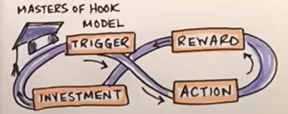

# 02行为改变策略

## 001 介绍

行为改变策略是旨在帮助用户采用新行为或打破现有行为以实现特定目标（如更健康的生活方式或更高的工作效率）的技术。

以下是用户体验设计中经常采用的一些关键行为改变策略：

- **设定目标**：要求用户设定具体、可衡量、可实现、相关、有时限（SMART）的目标，可以帮助他们集中精力，跟踪进展。
- **反馈和奖励**向用户提供有关其进展情况的实时反馈，并给予积极的强化奖励（如徽章或积分），可以提高用户的积极性和参与度。
- **社会比较**：促进用户或群体之间的比较可以利用社会影响和规范压力，通过竞争或合作鼓励行为改变。
- **提醒和提示**：及时发送提醒或提示有助于强化预期行为，使这些行为更加突出，更受关注。
- **选择架构**：对选项、默认设置和信息的展示进行结构化设计，可以在不限制用户自由选择的前提下，引导用户做出更好的决定。
- **榜样和故事**：通过榜样、案例、推荐或故事来展示理想的行为，可以提供灵感和社会证明，证明改变是可能的、可取的。
- **渐进式披露**：逐步引入高级功能、内容或挑战，可以帮助用户建立技能和信心，防止他们感到不知所措或失去兴趣。
- **个性化和量身定制**：根据用户的偏好、历史记录或特征定制内容或推荐，可使干预措施更加相关和有效。

## 002行为分类：BJ 福格的行为网格

BJ Fogg 行为网格是一个帮助用户体验设计师、产品经理和营销人员理解和识别不同行为变化类型的框架。该网格由斯坦福大学教授 B.J. Fogg 创建，根据三个维度的组合包括 15 种行为类型：持续时间、频率和强度。

### 持续时间Duration

- **一次性行为**：这些行为只发生一次（如注册账户）。
- **短期行为**：在有限时间内发生的行为（如使用产品试用版）。
- **长期行为**：持续或在相当长的时间内反复发生的行为（如持续使用某种产品）。

### 频率Frequency

- **单次行为**：每次只发生一次的行为（例如，输入密码登录一次）
- **非经常性行为**：不经常发生或偶尔发生的行为（例如，每周在社交媒体上发布一次信息）
- **频繁行为**：持续、定期发生的行为（例如，每天多次查看电子邮件）

### 强度Intensity

- **低风险行为**：影响较小或不太重要的行为（如选择个人资料图片）
- **中等风险行为**：重要性或影响适中的行为（例如，决定分享多少个人信息）
- **高风险行为**：对用户体验或产品感知有重大影响的行为（如购买或取消订阅）

## 003改变用户行为的策略

### 1. 支持用户有意识的行动

#### 介绍

- **了解用户当前的行为**：要有效地改变用户行为，首先需要了解他们**当前的习惯和模式**。通过访谈、调查和观察进行用户研究，找出他们的**痛点和动机**。
- **设定明确的目标**：为你想要实现的行为改变确定具体、可衡量、可实现和相关的目标。这可能包括增加完成任务的数量或减少完成任务所需的时间。
- **利用行为心理学**：利用行为心理学的理论和模型，如福格行为模型或计划行为理论，设计针对用户行为关键方面的干预措施。这些模型有助于解释影响行为的不同因素（如动机、能力和触发因素）之间的关系。
- **设计要简单**：让用户尽可能轻松地采取所需的行为。减少障碍，简化流程，尽量减少执行任务所需的认知负荷。
- **提供反馈和强化**：通过提供即时、清晰和具体的反馈，帮助用户了解其行为的影响。奖励或表扬等积极的强化措施也能鼓励用户继续从事所需的行为。
- **利用社会影响力**：人们通常会受到他人行为的影响，因此可以考虑在用户体验设计中融入社交证明、竞争或协作等元素。
- **个性化体验**：根据用户的个人偏好和学习风格定制入职流程、信息和内容。这可以提高参与度，增加行为改变的可能性。
- **迭代和评估**：不断测试和完善设计，提高行为改变策略的有效性。通过测量用户行为的变化来评估干预措施是否成功，并相应调整方法。

#### 1.1 帮助用户思考他们的行动

要成功改变用户行为，关键是要鼓励用户有意识地思考自己的行为。这可以通过在用户体验设计中采用各种策略来实现。以下是一些帮助用户思考其行为的有效方法：

- **激励措施**：为完成特定操作的用户提供奖励或激励，这将使他们更愿意思考自己的操作，并积极参与到操作过程中。
- **进度指示器**：显示清晰的进度指标，向用户展示他们在流程中所处的位置以及所取得的进展。这将有助于用户评估其行动的结果，并激励他们完成流程。
- **反馈**：向用户提供有关其行为的实时反馈是让他们更加注意自己行为的好方法。您可以使用通知、消息或视觉提示来告知用户其行为的积极或消极结果。
- **指导**：在用户使用界面时为他们提供指导和支持。通过入门教程、工具提示或基于上下文的说明，帮助用户了解其操作的效果、相关原因以及如何有效使用。
- **确认**：在用户执行可能产生重大影响的关键操作前，要求他们确认。这种暂停会迫使他们思考自己的选择，并评估其行动的潜在影响。
- **个性化**：将用户的行为结果与其个人目标或愿望联系起来。如果用户能从自己的生活背景中感受到行动的效果，他们就更有可能思考自己的行动。

#### 1.2 教育和鼓励用户

用户体验设计的主要目标之一是引导用户完成应用程序或网站的预期流程，这通常涉及鼓励用户改变自己的行为或习惯。教育和鼓励用户可以通过指导、反馈和积极强化等各种方法来实现。

- **指导**：提供简洁明了的说明、解释和帮助文本，确保用户了解如何使用应用程序。使用入门教程、工具提示和上下文帮助可以大大改善用户体验，并在必要时帮助用户改变行为。
  - 举例说明：在用户第一次与您的应用程序交互时，播放一段简短的教程，重点介绍他们可能不知道的关键功能。
- **反馈**：当用户与您的应用程序交互时，向他们提供实时反馈。反馈内容可以是基本通知，也可以是针对用户特定行为的更详细信息。
  - 举例说明：当用户创建密码时，显示一个交互式强度表，显示用户选择的密码是强还是弱。这可以鼓励用户选择更强、更安全的密码。
- **积极强化**：通过奖励达到里程碑或完成任务的用户，鼓励他们继续使用你的应用程序。这可以通过徽章、积分和进度指标等游戏化元素来实现。
  - 举例说明：为填写个人资料或连接社交媒体账户的用户颁发徽章。这可以鼓励用户充分使用您的应用程序，并养成定期使用的习惯。
- **社会影响**：利用社交证明促进用户行为的改变。展示其他用户的行为或观点可以营造一种社区感，促使用户效仿。
  - 举例说明：显示完成某项任务或为某篇内容向上投票的用户数量，这可能会激励其他用户追随这一明显趋势。
- **个性化**：根据用户的偏好、使用模式和以往的互动情况，为他们提供量身定制的内容，从而满足他们的需求。个性化能让用户对应用程序产生更强烈的投入感，从而鼓励他们持续使用并参与其中。
  - 举例说明：根据用户的浏览历史，为其提供个性化的文章或产品推荐，从而提升用户体验，增加重复访问的可能性。

### 2. Cheating技巧

在行为改变策略中，Cheating是指在设计的系统中创造捷径和漏洞，以克服用户在实现目标时可能遇到的任何障碍。作为用户体验设计师，你需要了解用户通常会寻找最简单的途径来实现他们的目标，即使这意味着要弯曲或打破既定规则。

#### 何时使用

- **克服限制**：当系统或环境施加的限制阻碍用户以有意义的方式前进时，允许用户克服这些限制。
- **增强动力**：当用户感到困顿或不知所措时，Cheating机制（如提示、秘籍）可以帮助他们感受到进步或成就感，从而激励他们继续前进。
- **增强用户体验**：有时，作弊可以创造有趣和引人入胜的体验，将普通任务转化为令人愉悦的挑战，让用户乐于探索和利用。

#### 如何设计

- **平衡**：Cheating应提供替代解决方案，同时不影响系统提供的整体挑战或价值。努力在简化任务和避免过度利用之间取得平衡，因为过度利用可能导致不劳而获或淡化用户体验。
- **限制访问**：在设计中，Cheating不应成为默认行为或最常用的策略。限制Cheating的访问或机会，以避免削弱用户的成就感或疏远非作弊用户。
- **文档和沟通**：如果允许Cheating是一种有意的设计选择，那么请明确地向用户传达这一点，这样他们就不会因为利用漏洞而感到内疚。让用户了解Cheating选项有助于营造一种用户有意违反规则的环境，从而为整体用户体验增添有趣的活力。
- **监控**：持续监控用户与设计的互动情况以及Cheating行为的普遍程度。如果Cheating行为变得过于普遍或有害，应考虑调整系统并解决任何意想不到的后果。

#### 2.1 默认设置

用户体验设计中的 "默认设置 "是指根据最常见或首选的选项为用户预先选择选项或设置的做法。其目的是简化决策过程，尽量减少用户完成任务或与界面交互所需的工作量。

##### 好处

- 方便用户：通过为用户预选选项，可以节省他们做出选择的时间和精力。这将带来更流畅的用户体验，尤其是对那些可能没有强烈偏好或对手头任务没有深入了解的用户而言。
- 减少错误和混乱：默认选项可以帮助用户避免出错，如选择不兼容的格式或不正确的设置。通过选择合理的默认值，可以引导用户做出适当的选择，从而最大限度地减少混乱和潜在问题。
- 促进预期行为：如果想鼓励用户采用特定的操作或设置，将其设置为默认选项可以提高采用率。例如，将默认隐私设置设置为 "高"，可以促进用户采用更好的安全操作。

##### 设计原则

- **考虑用户需求和偏好**：默认值应根据用户研究和对受众的了解，与用户最常见或最喜欢的操作保持一致。
- **透明化**：让用户清楚地知道你已代表他们预选了一些选项，并**提供必要时更改这些选项的方法**。
- **定期审查和调整**：随着用户群或产品的发展，必须对默认设置进行审查和调整，以确保它们始终与用户相关并对他们有帮助。

#### 2.2让一些变得偶然和自然

指的是在用户从事另一项主要任务时，巧妙地引入一项功能或元素。这种方法的目的是**避免打断用户的流程**，防止他们感到不知所措，并让他们在**发现该功能时感觉更加自然和偶然**。

##### 好处

- **不至于让人不知所措**：用户不会一下子受到过多信息的轰炸，因为当他们正在处理另一项任务时，系统会顺便介绍相关信息。
- **避免分心**：它不会扰乱应用程序的流程，使用户能够继续专注于其原有任务。
- **提高用户参与度**：当用户偶然发现他们将来可能需要或有用的功能或元素时，这可能会加深他们与产品的联系。

##### 设计技巧

- **逐步披露**：在用户当前任务的背景下，适时披露相关信息或功能。
- **引导式互动**：在用户积极参与任务时介绍功能，**让发现成为互动的有机组成部分**。
- **情境提示**：为用户提供**微妙的提示或建议**，表明存在其他功能，以便在需要时使用。

#### 2.3使重复行为自动化

用户经常需要执行重复性任务，这可能会导致挫败感和降低效率。为了提升用户体验并确保一帆风顺，必须尽可能通过自动化重复性任务来减少或消除重复操作的需求。

##### 好处

- **节省时间**：通过减少重复操作，用户可以更快地完成任务，提高生产率。
- **减少错误**：任务自动化可最大限度地减少人为错误，确保每次操作都能正确完成。
- **提高用户满意度**：减少繁琐的任务可以带来更积极的用户体验，提高用户留存率。

##### 设计策略

- **预填表单**：在表单字段中自动填写用户之前输入或可能输入的信息，如姓名、电子邮件地址或电话号码。这可以节省用户填写表格的时间和精力。
- **记住用户偏好**：存储用户设置和偏好，如首选语言、货币或主题，这样用户就不必在每次访问网站或应用程序时都重新设置。
- **智能建议**：根据用户输入或以往行为实施预测文本或自动建议。例如，在输入搜索查询或填写表格时，用户可能会喜欢能帮助他们快速完成任务的建议。
- **批量操作**：允许用户以分组而非单个方式执行操作，如选择或删除项目。这可以大大减少完成任务所需的点击次数和时间。
- **键盘快捷方式**：为常用操作提供键盘快捷方式，使用户无需使用鼠标或触摸交互即可执行任务。这对高级用户或有无障碍需求的用户尤其有帮助。

### 3.创造或改变用户习惯

#### 介绍

养成或改变习惯是用户体验设计的一个重要方面，其重点是帮助用户采用新的行为和模式。

- 确定用户目标和障碍：首先要确定用户的最终目标，并找出可能阻碍他们实现预期结果的任何障碍。通过设计解决这些障碍，就能帮助用户克服困难，养成新习惯。
- 利用触发器：可在设计中加入触发器或提示，以提醒用户采取特定行动。触发器可以是视觉的（如按钮）、听觉的（如通知声音）或上下文的（如基于时间或地点的提醒）。在设计中加入触发器可以促进用户养成习惯。
- 简化流程：将复杂的任务或目标分解成更小、更易于管理的步骤，让用户更容易养成新习惯。这样，用户就不会感到不知所措，也更有可能坚持自己的行为。
- 纳入反馈和奖励：正面强化是鼓励养成新习惯的有力工具。在用户完成任务或实现目标后，为他们提供即时反馈，并给予奖励（如徽章、积分等）。这将激励用户，帮助他们继续使用您的产品。
- 利用社会影响力：人类是天生的社交动物；我们倾向于追随同龄人的行为和趋势。在设计中融入社交元素，可以促进良性竞争，在用户中营造社区感，进一步激励他们养成新习惯。
- 迭代和改进：最后，通过不断分析和迭代你的设计，始终努力改进。收集用户反馈，找出用户可能在哪些方面难以形成或保持新习惯，并相应调整设计。

#### 3.1 让用户上瘾：创造习惯

##### 尼尔-埃亚尔的钩子模型

旨在通过更深层次地吸引用户来帮助创造形成习惯的产品和服务。埃亚尔的模型基于四个关键要素，旨在鼓励用户互动和重复使用，最终让用户上瘾。这些要素是：

- **触发器Trigger**：触发器是通过外部刺激或内部动机促使用户采取行动的线索。外部触发因素可以是通知、广告，甚至是朋友的推荐，而内部触发因素则源于用户的想法或情绪，如无聊或需要社交联系。
- **行动Action**：行动是用户针对触发器执行的简单任务。操作取决于情境和产品，但一般来说，行动应简单易行，并与触发器有明确的联系。例如，在约会应用中收到通知后向左或向右滑动。
- **可变奖励Variable Reward**：奖励用户的行动是虎克模式的重要组成部分。可变奖励指的是用户的行为会得到不同程度的满足--这种不可预测性会让用户保持参与和好奇。社交媒体平台就是很好的例子，因为用户会随机获得点赞、评论或转发，促使他们继续互动，以获得更多奖励。
- **投资Investment**:这部分的重点是用户对产品投入时间或精力，从而增加未来参与的可能性。投资可能包括创建个人档案、添加好友或策划内容。用户在对产品进行投资后通常会有一种主人翁感，从而更有可能返回并继续使用该产品。

##### 提示-例程-奖励模型（习惯循环）

提示-例程-奖励模型，又称 "习惯循环"，是一个描述习惯如何在大脑中形成和维持的神经学框架。通过了解这一模型，用户体验设计师可以创造出更吸引人、更令人上瘾的用户体验，鼓励用户反复使用产品。

- **Cue提示**：促使大脑养成习惯的刺激或触发因素。可以是手机上的通知，也可以是日常作息或特定地点。
- **Routine例程**：你根据提示做出的实际习惯或默认动作。这通常是一种**自动行为**，**不需要经过太多有意识的思考**。
- **Reward奖励**：大脑从完成**例行公事**中获得的**满足感或积极强化**。这种多巴胺在大脑中的释放有助于长期强化和巩固习惯。

如何应用：

- **确定**可作为用户参与产品的触发因素的**潜在提示**。这可能包括推送通知、视觉提示或个性化信息。
- 设计直观、用户友好的**无缝例程**，让用户轻松完成产品内的任务。这可能涉及明确的行动号召、简约设计或熟悉的设计模式等任何方面。
- 确保为用户**提供有意义的奖励**，让他们感受到成就感或获得某种形式的积极反馈。这可以包括个性化内容、社交验证或进度跟踪。

#### 3.2用户行为已存在：改变习惯

##### 帮助用户避开提示

帮助用户避免引发不必要行为的线索。暗示是引导用户执行特定行为的信号或提示。通过识别和减少这些暗示，您可以有效地**引导用户获得更简化、更高效的用户体验**。

- **识别暗示**：第一步是识别导致不受欢迎行为的线索。这可以通过观察用户、进行可用性测试或用户反馈来实现。
- **删除提示**：一旦识别出线索，就应将其移除或最小化，以防止用户执行不希望的操作。这可以通过重新设计界面、改变布局或调整元素的视觉层次来实现。
- **提供替代方案**：为用户提供替代操作或路径，以便在不遇到不需要的提示的情况下实现目标。确保这些替代方案易于访问，并具有明确的行动号召元素。
- **教育用户**：有时，仅仅移除提示是不够的。在这种情况下，重要的是向用户介绍执行任务的新最佳方式。这可以通过应用内指南、教程视频或工具提示来实现。
- **监控用户行为**：持续评估用户行为和反馈，确保不需要的提示不再造成问题。如有必要，做好进一步调整的准备，并考虑实施 A/B 测试以优化解决方案。

##### 优化流程

在用户体验设计过程中，**了解和利用现有用户行为至关重要**。其中一个重要方面就是 "取代常规 "的概念。这包括观察和分析用户当前的习惯和常规，然后围绕这些习惯和常规设计产品。

为用户找到更高效、更愉悦、更吸引人的方式来完成任务。你不应该把一套全新的行为方式强加给你的用户，而应该**通过为他们现有的习惯提供更好的替代方式来改善他们的体验**。

- **了解用户背景**：研究用户的生命周期，创建 "角色"，以便更好地理解他们。 这可以帮助你识别他们的偏好、痛点和习惯，进而创造出有意义和有效的设计。
- **确定现有的习惯**：分析用户当前的习惯。为了完成任务，他们习惯采取哪些步骤？这些信息对于设计一款产品，用改进后的产品顺利取代用户现有的常规操作至关重要。
- **设计改进的常规流程**：创建一个新的用户流程，以更高效、更简单、更直观的方式实现相同的目标。这一新的流程应充分利用你所获得的有关用户及其偏好的知识。
- **测试新流程**：可用性测试的重要性怎么强调都不为过。通过让真实用户进行测试来验证你的设计，并收集反馈意见，找出可以进一步优化的地方。确保新例程在现有例程的基础上有所改进，不会造成新的混乱。
- **迭代和完善**：用户体验设计是一个持续的过程。根据用户反馈和不断变化的用户行为趋势，不断完善和优化新的常规设计。

##### 有意识地干预

了解用户的现有行为的方法：包括有意识地、深思熟虑地观察和分析用户行为，以发现问题或需要改进的地方，然后根据这些见解设计解决方案。

- **观察**：首先观察用户在自然环境中使用您的产品或与类似产品互动的情况。这将为您了解他们的习惯、偏好和挑战提供宝贵的信息。
- **分析**：接下来，分析从观察中收集到的数据。找出模式、问题和改进机会。这可能包括将任务分解成更小的组成部分、检查特定的用户流或比较不同的用户群。
- **同理心**：对用户产生深刻的共鸣，了解他们的需求、问题和动机。这将帮助你确定功能和改进的优先次序，并设计出真正满足他们需求的解决方案。
- **实验**：根据对用户的分析和感同身受的理解，提出多种想法和可能的解决方案。通过快速原型设计和用户测试来测试这些想法，以获得反馈并对设计进行迭代。
- **衡量影响**：通过监控用户行为和关键绩效指标（KPI），持续衡量设计变更的影响。这将有助于您了解干预措施的效果，并为未来的设计决策提供依据。

##### 正念（Mindfulness）：避免采取了不希望的行为

正念是一种强大的技巧，可以帮助设计者和用户避免对引发不良行为的线索采取行动。

保持正念的方法：

- 专注：在设计或使用产品时，专注于手头的任务，避免多任务处理。通过全身心地投入，你会更清楚地意识到可能引发不良行为的线索。
- 观察而不评判：注意在与产品互动时出现的任何强迫或冲动，但不要评判它们的好坏。只要承认它们的存在，就能帮助你理解自己的反应，并在未来做出更好的选择。
- 暂停并反思：当你注意到一个提示时，花点时间暂停一下，评估一下你的选择。考虑一下你即将采取的行动是否与你的目标一致，或者是否是你想要改变的。
- 用心应对：反思自己的选择后，有意识地决定下一步行动。这可能意味着继续原来的行为，选择更理想的替代方案，或者完全不采取行动。

如何融入设计：

- **减少干扰**：力求减少视觉杂乱、不必要的提示以及任何可能将用户注意力从当下转移的东西。
- **提供清晰的操作提示**：确保所需的操作提示清晰易懂，让用户能够更自觉地决定自己的操作。
- **支持用户反思**：考虑加入促使用户反思自己行为的功能，如目标设定或进度跟踪工具，这可以鼓励用户做出更明智的决策。

##### 用新行为取代旧习惯

包括识别用户目前的行为和习惯，并找到用更有效、更健康或更愉快的行为取代它们的方法。

**①识别旧习惯：**

可以通过用户访谈、调查或分析收集到的使用数据来实现。尝试找出哪些习惯不再有用、可能令人沮丧或耗费时间，或者可以大幅改进。

**②设计新行为：**

- 让新行为简单易行：确保新行为易于理解和执行，以便用户自然而然地采用。
- 使用视觉提示：在设计中融入视觉提示，巧妙地提醒用户应该执行的新行为。
- 正向强化：通过提供反馈、奖励或激励措施，鼓励用户采用新行为。
- 渐进式：逐步向用户介绍新行为，让他们有足够的时间适应并了解新行为的好处。

**③实施和测试：**

设计出新的行为后，就需要在产品中实施并测试其有效性。这种测试可以通过**A/B 测试、焦点小组**或可以提供宝贵反馈的测试版用户来完成。

**监控**用户行为并**分析数据**，以确定新行为是否成功取代了旧习惯。如有必要，可反复修改设计，进行必要的改进，并继续跟踪用户行为，直到新习惯牢固确立。

## 参考资料

[默认值的力量](https://www.nngroup.com/articles/the-power-of-defaults/)

["Hooked" by Nir Eyal - BOOK SUMMARY](https://www.youtube.com/watch?v=iw1x0zos8Jo)